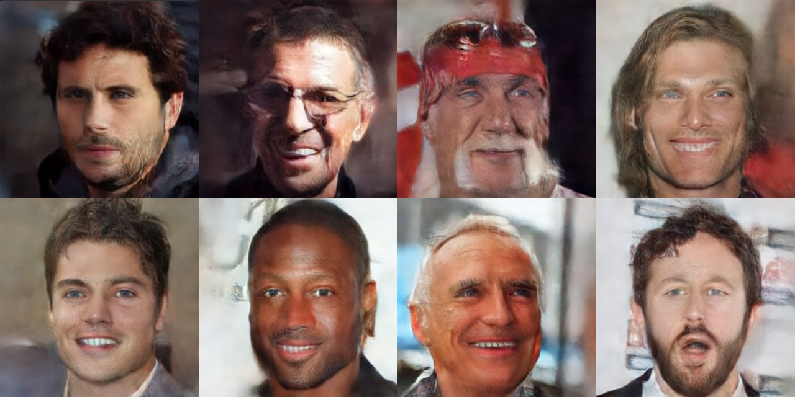

# Latent Diffusion

This folder contains a latent diffusion implementation.

The parameters of the autoencoder are:
* Output size: 3x256x256
* Latent size: 8x16x16
* Encoder parameters: ~5.4 M
* Decoder parameters: ~29.5 M
* Discriminator parameters: ~1.6 M
* Training epochs:
    * 50 epochs with MSE loss
    * 400 epochs with MSE + adversarial BCE loss
* Training data size: 2000 images from the celeb dataset
* Optimizer: AdamW
    * Critic generator ratio: 4:1
    * Batch size: 8
    * Betas: [0.5, 0.9]

The parameters of the diffusion network are:
* Input size: 8x16x16
* Parameter count: ~37.3 M 
* Training epochs: 400 epochs
* EMA model beta: 0.999
* Optimizer: AdamW
    * Batch size: 8
    * Betas: [0.9, 0.999]
